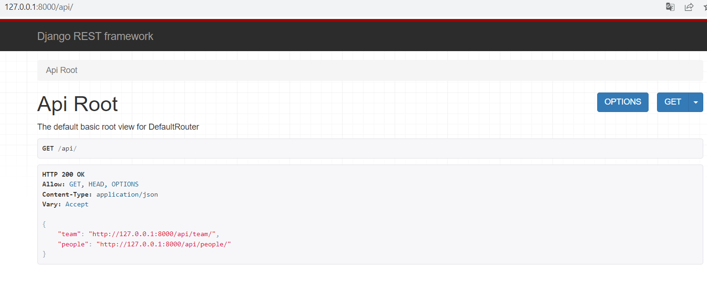

# REST API

REST API is a Django app with CRUD (create, read, update, delete) endpoints for teams and people in those teams.

## Installation

Use the package manager [pip](https://pip.pypa.io/en/stable/) to install requirement libraries.

```bash
pip install -r requirements.txt
```

## Usage

```python
# Create migrations for creating tables in the database
cd drfsite  # make sure you are in the main drfsite folder
python manage.py makemigrations
python manage.py migrate

# Run server
python manage.py runserver
```

## REST API screenshots


